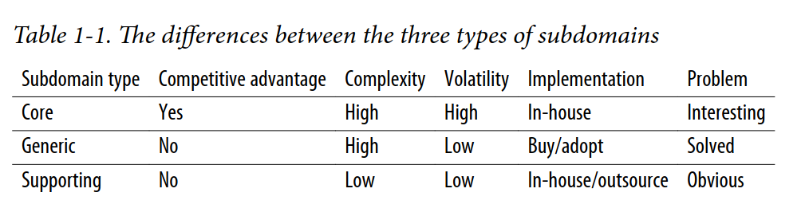

# Part 1: Strategic Design

Снова, стратегическая часть DDD отвечает на вопрос "Что?" и "Почему?", что за приложение мы строим и почему мы строим его. Тактическая часть отвечает на вопрос "Как?" - как мы можем построить наше приложение. 

## Chapter 1 

**Business Domain** - это предоставляемая бизнесом услуга. 

> A business domain defines a companys main area of activity 

Например, бизнес-доменом Starbucks является - кофе, Uber - такси и т.д. 

У бизнеса может быть несколько бизнес-доменов. Ранее упомянутый Uber также занимается доствкой и арендой транспорта. 

**Subdomain** - "это узконаправленная область бизнес-активности. Все субдомены компании образуют её бизнес-домен — ту услугу, которую она предоставляет своим клиентам."

> Реализации одного субдомена недостаточно для успеха компании; это лишь один строительный блок в общей системе. Субдомены должны взаимодействовать друг с другом, чтобы компания могла достичь своих целей в рамках бизнес-домена. Например, компанию Starbucks, вероятно, больше всего ассоциируют с кофе, но для создания успешной сети кофеен недостаточно просто уметь варить отличный кофе. Необходимо также покупать или арендовать недвижимость в выгодных локациях, нанимать персонал, управлять финансами и решать множество других задач. Ни один из этих субдоменов по отдельности не сделает компанию прибыльной. Все вместе они необходимы для того, чтобы компания могла конкурировать в своём бизнес-домене (или доменах).

Есть 3 типа субдоменов: 

- Generic 
- Support 
- Core 

**Core Subdomain** - это то, что отличает один бизнес от другого, некая отличительная услуга. Сюда входит: создание новых продуктов или услуг, снижение издержек за счет оптимизации существующих процессов.

Возьмём для примера Uber. Изначально компания предложила новую форму транспорта — каршеринг. Когда конкуренты подтянулись, Uber нашёл способы оптимизировать и развивать свой основной бизнес: например, снижать затраты, подбирая пассажиров, следующих в одном направлении. Ключевые субдомены Uber влияют на его чистую прибыль. Именно так компания отличает себя от конкурентов. Это и есть её стратегия по предоставлению лучшего сервиса клиентам и/или максимизации прибыльности.

> Чтобы сохранять конкурентное преимущество, ключевые субдомены предполагают наличие изобретений, умных оптимизаций, бизнес-ноу-хау или другой интеллектуальной собственности.

**Generic Subdomain** - это бизнес-активности, которые все компании выполняеют одинаково. В отличии от Core Subdomain этот субдомен не дает никаких конкуретных преимуществ и в связи с этим нет нужды в оригинальных решениях. Допустим, нужно сделать авторизацию и аутентификацию, вместо того, чтобы придумывать свое оригинальное решение и выделять их среди всех прочих, легче взять готовое и проверенное многими бизнесами решение. 

**Support Subdomain** - это субдомен, существующий для поддержки бизнеса. Например, команды занимается тем, что выявляет баги, рефакторит код или поддерживает уже готовый продукт. 

Краткая таблица:

### Как определить границы субдоменов?

Технический взгляд на поддомен: Это не просто бизнес-понятие, а набор взаимосвязанных и целостных usecases.

Признаки целостности: Если несколько задач (вариантов использования) работают с одними и теми же исполнителями (actors) и одними и теми же данными, их логично объединить в один поддомен.

Критерий остановки: Этот принцип служит ориентиром, чтобы не дробить систему слишком мелко. Как только вы выделили набор вариантов использования, которые плотно связаны между собой (и слабо — с внешним миром), вы нашли наиболее точную границу поддомена.

### Нужно ли всегда стремиться к такой максимально точной границе поддомена?

Это обязательно для ключевых (core) поддоменов. Они самые важные, изменчивые и сложные. Их нужно максимально «дистиллировать» (очистить), чтобы отделить все типовые и вспомогательные функции и сконцентрировать усилия на самой ценной логике.

Для вспомогательных (supporting) и типовых (generic) поддоменов требования к детализации могут быть мягче. Если дальнейшее дробление не дает новой информации, которая повлияет на проектные решения, можно остановиться.

**Когда стоит остановиться?**

Например, когда все более мелкие поддомены относятся к тому же типу, что и исходный. Если для решения мы всё равно будем использовать готовый «коробочный» инструмент (как в примере с системой поддержки Help Desk на Рисунке 1-4), то глубокое дробление такого поддомена не несет стратегической ценности.

**Важный вывод:**
При определении поддоменов нужно также учитывать, нужны ли они нам все (и все ли они требуют одинаково глубокой проработки).

